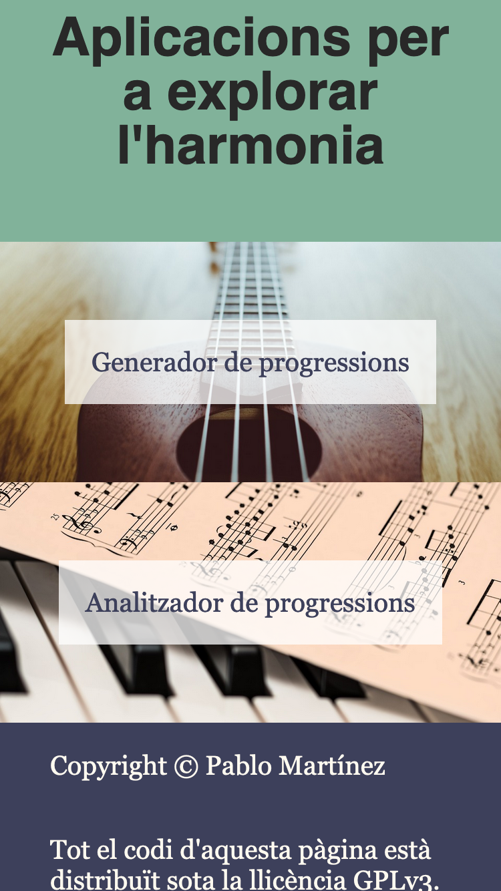
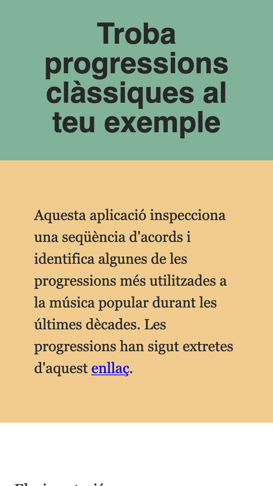
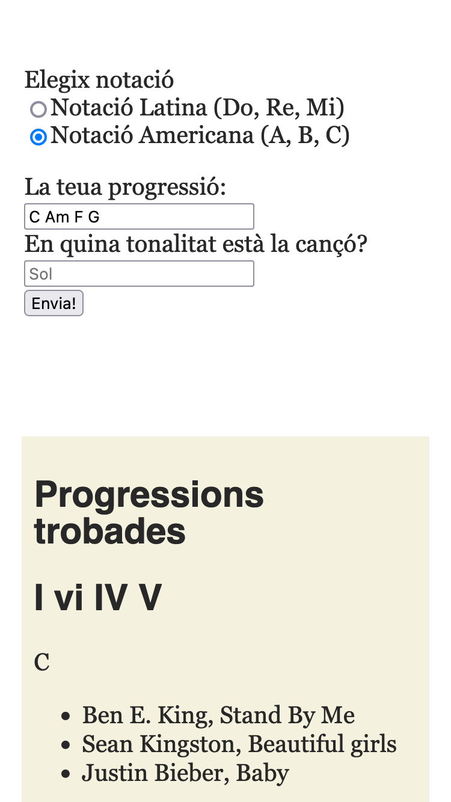
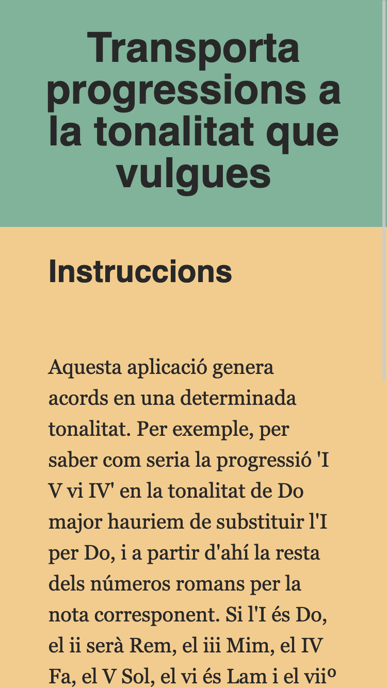
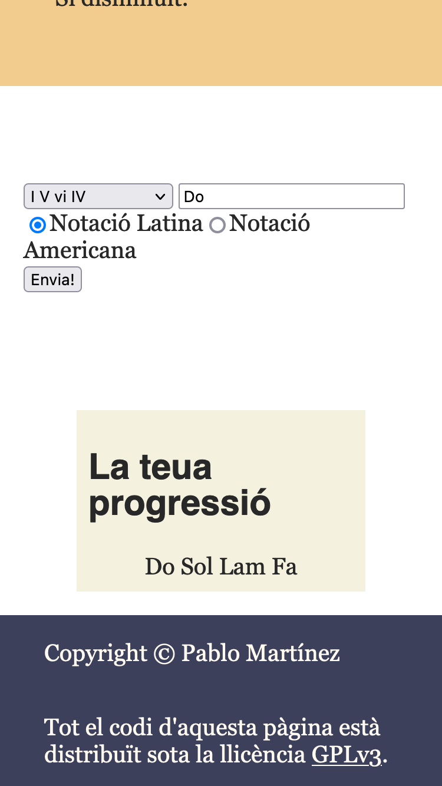

# Chord progression comparison
## About
This project is a little webapp with two very basic tools for the study of
harmony. There is a tool that compares a given chord progressions to a dict
with standard ones, like [I vi ii V](https://www.youtube.com/watch?v=MrTz5xjmso4)
or [I V iv IV](https://www.youtube.com/watch?v=0mPAO0R8uuQ). The dictionary is
made by hand, using examples from [this forum
discussion](https://www.hispasonic.com/foros/armonia-pop-para-torpes/501174).
Any suggestion is welcome!

The other tool is a 'chord progression generator'. It lets the user select from
all the available progressions on the dictionary mentioned above and transpose
said progression to a given key. The goal is to make it easier to transpose a
chord progression you already know you like to a confortable key for your vocal
register.

This app was originally made to be used by my highschool students, and so it is
completely in valencian. Here are some pics:

{width=50%;}
{width=50%;}
{width=50%;}
{width=50%;}
{width=50%;}

## Setup
To set it up clone this repo to your computer
`git clone https://github.com/pablomartan/chord_progression_comparison`

You will need [Node.js](https://nodejs.org/en/) and [npm](https://www.npmjs.com/).
Once you have them installed navigate to the repo you cloned this repo on and
run the following command to install dependencies (Webpack and some plugins for
it):
`npm i`.

You will need a python environment. Refer to [this
site](https://wiki.python.org/moin/BeginnersGuide/Download) if you don't know
how to achieve it. If you use a GNU/Linux distro search your package manager
for python3, altough it probably is already installed on you system. You will
also need `pip` to install the [mingus library](https://github.com/bspaans/python-mingus).
To install `pip` refer to its
[docs](https://pip.pypa.io/en/stable/installation/). Once installed, you can
get mingus by running `pip install mingus` on a terminal.

Once you have it set up you can run `npm run build-prod` and `npm start` to get
a working example on `http://localhost:8081`. You can then access it on your
web browser and start using it.

If you would like to change the chord
progressions, add examples, or simply play with the code, you can run `npm run
build-dev` to get a dev server that reloads when you change the code for the
project. If your browser doesn't navigate automatically to
`http://localhost:8080` you can go manually. You'll need to run the server also
with `npm start`.

## License
All the code in this repo is licensed under the [GPLv3](./LICENSE) license.
